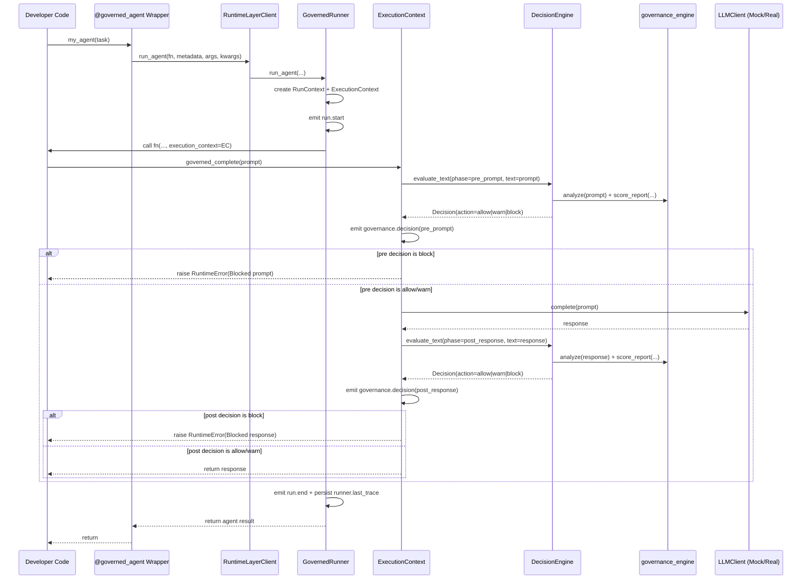

# Runtime Layer (`runtime/`)

This is the middle layer between the thin SDK decorator and actual execution.

Its job is to answer: **what happens when a decorated agent runs?**

It defines:
- governed run lifecycle (`run.start`, governance checks, `run.end`)
- pre/post execution governance checks
- event capture and hook fanout
- policy decisioning (`allow`, `warn`, `block`)
- execution backend abstraction (local now, cloud/sandbox later)

It uses `governance_engine` directly in-memory.

---

## Modules

- `runner.py`
  - `GovernedRunner` (main orchestrator)
  - `ExecutionBackend` protocol
  - `LocalExecutionBackend` (implemented)
  - `CloudExecutionBackend` (stub for your future sandbox integration)
- `execution_context.py`
  - `ExecutionContext` injected into agent call (if function accepts `execution_context` or `ctx`)
  - `governed_complete(prompt, ...)` runs pre/post governance checks around LLM call
  - `LLMClient` protocol + `MockLLM`
- `decision_engine.py`
  - Calls `governance_engine.detectors.analyze`
  - Calls `governance_engine.scoring.score_report`
  - Maps results to `DecisionAction`: `allow | warn | block`
- `policies.py`
  - `RuntimePolicy(alert_threshold=75.0, block_on_alert=False)`
- `trace_capture.py`
  - In-memory trace collector for run events
- `hooks.py`
  - Hook interface for external observers/integrations

---

## How decorator reaches runtime

Path from SDK decorator to runtime:

1. You decorate:

```python
@governed_agent(policy="default", client=RuntimeLayerClient(runner))
def my_agent(task: str, *, execution_context=None):
    ...
```

2. `sdk.decorators.governed_agent` wraps `my_agent` and builds `AgentMetadata`.
3. On call, wrapper invokes:
   - `client.run_agent(fn, metadata, args, kwargs)`
4. `RuntimeLayerClient` forwards that to:
   - `runner.run_agent(fn, metadata, args, kwargs)`
5. `GovernedRunner`:
   - creates `RunContext`
   - creates `ExecutionContext` (`DecisionEngine`, policy, LLM, trace, hooks)
   - injects `execution_context` into kwargs if accepted
   - executes function through selected backend (`LocalExecutionBackend` by default)
6. Inside agent code, when you call:
   - `execution_context.governed_complete(prompt, model=...)`
7. Runtime performs inline checks:
   - **pre_prompt**: `analyze(prompt)` + `score_report(...)`
   - optional block if `block_on_alert=True` and score alert trips
   - call LLM
   - **post_response**: `analyze(response)` + `score_report(...)`
   - optional block with same rule
8. Runtime emits trace events and stores `runner.last_trace`.

### Sequence diagram



---

## Policy behavior (current)

`RuntimePolicy` fields:
- `alert_threshold`: default `75.0`
- `block_on_alert`: default `False`

Decision mapping in `decision_engine.py`:
- `score < threshold` -> `allow`
- `score >= threshold` and `block_on_alert=False` -> `warn`
- `score >= threshold` and `block_on_alert=True` -> `block`

So today, default mode is **observe/warn**, not blocking.

---

## Local vs Cloud backend

Runtime is backend-agnostic by interface:

- Local:
  - `backend=LocalExecutionBackend()` (default)
  - runs callable in-process
- Cloud/sandbox:
  - `backend=CloudExecutionBackend(endpoint=...)` currently raises `NotImplementedError`
  - this is intentional extension point for your separate sandbox execution folder

When you build sandbox integration, implement `ExecutionBackend.run_callable(...)` there and plug it into `GovernedRunner`.

---

## End-to-end example

See: `examples/runtime_governed_llm.py`

Run:

```bash
PYTHONPATH=. python3 examples/runtime_governed_llm.py
```

What it shows:
- decorator -> runtime bridge via `RuntimeLayerClient`
- runtime-injected `execution_context`
- prompt + response governance checks
- printed trace events with phase/action/score/rule_hits

---

## Minimal usage pattern

```python
from runtime import GovernedRunner, RuntimePolicy, MockLLM
from sdk import RuntimeLayerClient, governed_agent

runner = GovernedRunner(
    policy=RuntimePolicy(alert_threshold=75.0, block_on_alert=False),
    llm=MockLLM(),
)

@governed_agent(policy="default", client=RuntimeLayerClient(runner))
def my_agent(task: str, *, execution_context=None):
    prompt = f"Do something with: {task}"
    return execution_context.governed_complete(prompt, model="mock-1")
```

