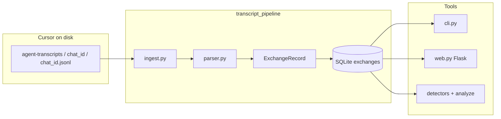

# Transcript pipeline — full documentation

This document describes everything under `transcript_pipeline/`: concepts, data model, ingestion, the SQLite database, CLI commands, the web UI, and the detector system.

**Quick start:** ingest transcripts → query with `db` commands or browser → optionally run `detect` on stored rows.

---

## Table of contents

1. [What this package does](#1-what-this-package-does)
2. [Glossary](#2-glossary)
3. [End-to-end architecture](#3-end-to-end-architecture)
4. [Cursor transcript source](#4-cursor-transcript-source)
5. [Parsing: from JSONL to “exchanges”](#5-parsing-from-jsonl-to-exchanges)
6. [SQLite database](#6-sqlite-database)
7. [Ingest CLI](#7-ingest-cli)
8. [Database CLI (`db`)](#8-database-cli-db)
9. [Web UI (`serve`)](#9-web-ui-serve)
10. [Detectors](#10-detectors)
11. [Python module entry points](#11-python-module-entry-points)
12. [Relationship to `ide-interceptor/`](#12-relationship-to-ide-interceptor)
13. [Limitations](#13-limitations)

---

## 1. What this package does

| Capability | Description |
|------------|-------------|
| **Ingest** | Read Cursor’s on-disk agent transcript JSONL files and normalize them into **rows** in SQLite. |
| **Query** | List projects, chat sessions, and **exchanges** from the DB (CLI or browser). |
| **Scan** | Run pluggable **detectors** (secrets, PII, sensitive context, sensitive paths) over text from those rows. |

It does **not** talk to Cursor’s network API. It only reads files under `~/.cursor/projects/...` and your local SQLite file.

---

## 2. Glossary

### Exchange (the most important term)

An **exchange** is **one logical turn** in a chat session, stored as **one row** in the `exchanges` table.

- **One user message** (after stripping Cursor’s `<user_query>...</user_query>` wrapper when present).
- **Plus** every **assistant** message that follows in the raw transcript **until the next user message**.
- Assistant chunks are **concatenated** (separated by blank lines) into a single `assistant_text` field.

So if the user sends three short messages in a row in the UI, the raw JSONL still has one `user` line per send; each starts a **new** exchange. If the model replies with **multiple** assistant JSONL lines before the user speaks again, those are **merged** into **one** exchange’s `assistant_text`.

**Why “exchange”?** It mirrors a common “user asks → assistant responds” unit, even when the assistant’s response is split across several transcript lines.

### `turn_index`

Zero-based order of exchanges **within one chat session** (`chat_id`). First user turn in that session is `turn_index=0`, next is `1`, etc.

### `chat_id`

UUID folder name under `agent-transcripts/`, e.g. `b608d697-fc98-423a-8ffd-5f3409aacbbd`. One folder = one agent chat session.

### `project_id`

Cursor’s standardized project directory name under `~/.cursor/projects/`, e.g. `Users-mahesh-Code-quick-mvp`. This is **not** necessarily your git repo name; it’s how Cursor names the project on disk.

### `id` (database row id)

SQLite `INTEGER PRIMARY KEY` for a row in `exchanges`. Unique **globally** in that database. Different from `turn_index` (which repeats per session).

### CLI “exchanges” subcommand

`python -m transcript_pipeline db exchanges` means: **list rows from the `exchanges` table** — i.e. list **stored exchanges**, not raw JSONL lines.

---

## 3. End-to-end architecture



---

## 4. Cursor transcript source

**Root for a project:**

`~/.cursor/projects/<project_id>/agent-transcripts/`

**Per session:**

`.../agent-transcripts/<chat_id>/<chat_id>.jsonl`

**Discovery rules (see `paths.py`):**

- Each subdirectory of `agent-transcripts` whose name matches a file `<name>/<name>.jsonl` is treated as one `chat_id`.

Ingest uses `project_id` and optional `chat_id` to resolve these paths.

---

## 5. Parsing: from JSONL to “exchanges”

**File:** `parser.py`

### Raw line format (typical)

Each non-empty line is JSON. Cursor commonly uses:

```json
{
  "role": "user" | "assistant",
  "message": {
    "content": [
      { "type": "text", "text": "..." }
    ]
  }
}
```

Text is extracted from `message.content[]` items with `type: "text"`. If the shape differs, a **fallback** walk looks for string fields named like `text` / `content`.

### User text normalization

If the user text is wrapped in `<user_query>...</user_query>`, the inner body is stored as `user_text` (see `normalize_user_text`).

### `contains_code` and `contains_file_reference`

These are **heuristics computed on `user_text` only** (not assistant text):

- **Code:** fenced blocks (```` ``` ````), heavy indentation, or lines looking like `import` / `def` / `class`, etc.
- **File reference:** `@path`, backticked paths with common extensions, etc.

They are stored as `0`/`1` in SQLite.

### Building the list of exchanges

`parse_transcript_jsonl(path, project_id, chat_id)`:

1. Loads all valid JSON objects from the file in order.
2. Scans linearly: each **`user`** line starts a new `ExchangeRecord`.
3. Consumes following **`assistant`** lines until the next **`user`** (or EOF).
4. Sets `raw_messages` to the count of JSONL lines attributed to that exchange (user + those assistant lines).
5. Assigns `turn_index` in order (0, 1, 2, …).

Leading non-user lines (e.g. stray assistant at file start) are skipped until the first user message.

---

## 6. SQLite database

**Default path:** `<repo_root>/data/transcripts.db` (override with `--db-path`).

**Class:** `TranscriptDB` in `db.py`.

### Table: `exchanges`

| Column | Meaning |
|--------|---------|
| `id` | Auto-increment primary key (row id). |
| `source` | Always `cursor_transcript` for current ingest. |
| `project_id` | Cursor project folder name. |
| `chat_id` | Session UUID (folder name). |
| `transcript_path` | Absolute path to the source `.jsonl` file. |
| `turn_index` | Order of this exchange within the session (0-based). |
| `user_text` | Normalized user message for this turn. |
| `assistant_text` | All assistant replies merged until next user. |
| `user_char_count` / `assistant_char_count` | Lengths of the above. |
| `contains_code` | `0`/`1`: heuristic on **user** text only. |
| `contains_file_reference` | `0`/`1`: heuristic on **user** text only. |
| `raw_messages` | Number of JSONL lines in this exchange. |
| `timestamp` | From transcript if present (often null). |
| `ingested_at` | When this row was last written/updated. |

**Uniqueness:** `UNIQUE(project_id, chat_id, turn_index)` — re-ingesting the same session **updates** the same logical row (upsert).

**Indexes:** `(project_id)` and `(project_id, chat_id)` for filtering.

---

## 7. Ingest CLI

**Module:** `ingest.py`  
**Command:**

```bash
python3 -m transcript_pipeline ingest --project-id <PROJECT_ID> [--chat-id <CHAT_ID>] [--db-path PATH] [--dry-run]
```

| Flag | Purpose |
|------|---------|
| `--project-id` | **Required.** Cursor project name, e.g. `Users-mahesh-Code-quick-mvp`. |
| `--chat-id` | Optional. Ingest only that session’s JSONL. If omitted, every discovered session under that project is ingested. |
| `--db-path` | SQLite file (default: `data/transcripts.db` under repo root). |
| `--dry-run` | Parse and print counts; do not write SQLite. |

**Output:** Per session, prints how many **exchanges** were parsed, then total rows written/updated.

---

## 8. Database CLI (`db`)

**Module:** `cli.py`  
**Invocation:**

```bash
python3 -m transcript_pipeline db <subcommand> [--db-path PATH] ...
```

Global option:

- `--db-path` — SQLite file (default same as ingest).

### `db stats`

Returns JSON:

- `total_exchanges` — row count in `exchanges`.
- `total_chat_sessions` — distinct `(project_id, chat_id)` pairs.

### `db chats`

Lists sessions with exchange counts. Optional `--project-id` to filter.

Example line: `Users-mahesh-Code-quick-mvp    <uuid>    turns=12`  
Here **`turns`** = number of **exchange rows** for that session.

### `db exchanges`

Lists **exchange rows** (the main “show me what’s in the DB” command).

| Flag | Purpose |
|------|---------|
| `--project-id` | Filter rows. |
| `--chat-id` | Filter rows. |
| `--limit` | Max rows (default `50`). |
| `--json` | Full row JSON to stdout. |

Human-readable lines show: DB `id`, `project_id`, `chat_id`, `turn_index`, `code`, `file_ref`, and a short **user** preview.

**Note:** Ordering is `ORDER BY project_id, chat_id, turn_index` — chronological order within a session matches `turn_index`.

### `db detect`

Runs **`analyze()`** from the detector orchestrator on text loaded from exchange rows (does **not** modify the DB).

| Flag | Purpose |
|------|---------|
| `--project-id` / `--chat-id` | Filter which rows to scan. |
| `--limit` | Max rows to fetch (default `200`). |
| `--text-source` | `user` \| `assistant` \| `both` (default `both`). |
| `--json` | Emit full per-row results including `findings`. |
| `--hits-only` | Suppress rows with zero findings (text mode). |
| `--compact` | One line per row: detector → rule ids only (no per-finding detail). |
| `--score` | Add **`policy`** (score, raw_points, alert, breakdown, combo bonuses). |
| `--alert-threshold` | Float; alert when `policy.score >= threshold` (default `75`). |

Each row: concatenate text per `--text-source`, run **all** registered detectors once, aggregate `Finding`s (redacted snippets only).

**Default (non-JSON) output** prints each finding with: **`detector_id`**, **`rule_id`**, **`reason`** (from `Finding.label`), **`matched`** (redacted snippet), and **`span`** (character offsets in the scanned text). JSON output already includes `label`, `redacted_snippet`, and `start`/`end`.

---

## 9. Web UI (`serve`)

**Module:** `web.py`

```bash
pip install -r requirements.txt   # needs Flask
python3 -m transcript_pipeline serve [--db-path PATH] [--host 127.0.0.1] [--port 5050]
```

- Single page: session list + **exchange** table with filters (`project_id`, `chat_id`, `limit`).
- Shows previews of `user_text` (truncated), not full assistant bodies in the table.

---

## 10. Detectors

Detectors are **plain classes** with:

- `id: str` — stable identifier (e.g. `secrets`, `pii`).
- `scan(self, text: str) -> Sequence[Finding]` — returns zero or more matches.

### Orchestrator (`detectors/orchestrator.py`)

- **`_REGISTRY`** — ordered list of detector instances.
- **`analyze(text)`** — for **each** detector in order, calls `scan(text)` on the **same** full string; wraps results in `DetectorRun` and returns **`AnalysisReport`**.
- **`register_detector(d, first=False)`** — add custom detectors at end or front.
- **`list_detectors()`** — list `id`s.
- **`reset_default_detectors()`** / **`clear_detectors()`** — testing or custom pipelines.

Nothing runs until **your code** calls `analyze` (e.g. `db detect` does that per row).

### Default detectors (layered concerns)

| Package / `id` | Responsibility |
|----------------|----------------|
| `detectors/secrets/` → `secrets` | API keys, Bearer/Basic, JWT-shaped strings, PEM private keys, DB URLs with credentials, sensitive `.env`-style keys, common cloud strings. |
| `detectors/pii/` → `pii` | Emails, phone-like patterns, SSN-shaped with light validation, credit-card-shaped **with Luhn**, US street heuristic, labeled account/customer IDs. |
| `detectors/sensitive_context/` → `sensitive_context` | Keywords (confidential, internal-only, …), deployment/config filenames, internal hostnames, private IPs, dev home paths, git/GitHub URLs, export/dump/log filename patterns. |
| `detectors/sensitive_files/` → `sensitive_files` | References to paths/files that often hold secrets (`.env`, `.aws/credentials`, kubeconfig, …). |
| `detectors/context_detection/exposure_scope/` → `context_exposure_scope` | **Governance scope** (not misuse): classifies interaction size/structure into `small_snippet`, `moderate_internal_context`, or `broad_internal_context_transfer` using chars, fenced-code lines, and `@` refs. Emits at most one finding per scan with **meta** metrics. Tuned to avoid flagging tiny messages. |
| `detectors/context_detection/paste_structure/` → `context_paste_structure` | Structured paste patterns: many markdown fences, many `@` references, or repeated “file:/path:” style labels — “multiple artifacts in one turn”. |
| `detectors/context_detection/technical_markers/` → `context_technical_markers` | Tracebacks / `File "…", line`, dense path tokens, architecture & ops keywords — combine with other detectors for review. |

Shared helpers: `detectors/context_detection/metrics.py` (`analyze_text_metrics`, `classify_exposure_tier`).

### Result types (`detectors/types.py`)

- **`Finding`** — `detector_id`, `rule_id`, `label`, `start`, `end`, `redacted_snippet`, optional `meta`. Intended to be **log-safe** (no raw secrets).
- **`DetectorRun`** — one detector’s list of findings.
- **`AnalysisReport`** — `findings` (merged, sorted), `by_detector`, `to_summary()`.

### Redaction (`detectors/redact.py`)

Short previews for secret-like values; full raw matches are not stored on `Finding` by design.

### Policy scoring (`scoring/`)

Post-pass over an **`AnalysisReport`**: sums **per-(detector, rule) weights** from **`ScoringRegistry`**, adds **combo bonuses** (e.g. broad context + secrets), caps at **`score_cap`** (default 100), and sets **`alert = score >= threshold`** (default 75).

- **`scoring/registry.py`** — `rule_weights` keyed by `detector_id` → `rule_id` → points; use `"*"` as default for that detector. Unknown pairs use **`global_fallback`** (dynamic when you add detectors without editing every rule).
- **`scoring/engine.py`** — `score_report(report, alert_threshold=75)`, `PolicyScoreResult.to_dict()`, `score_findings_dicts()` for serialized findings.
- **CLI:** `python3 -m transcript_pipeline db detect --score [--alert-threshold 75]` adds a **`policy`** object to JSON output and prints score / raw / combos in text mode.

---

## 11. Python module entry points

| Command | Effect |
|---------|--------|
| `python3 -m transcript_pipeline ingest ...` | Ingest (see §7). |
| `python3 -m transcript_pipeline db ...` | DB CLI (see §8). |
| `python3 -m transcript_pipeline serve ...` | Web UI (see §9). |
| `python3 -m transcript_pipeline` | Prints usage if no subcommand. |

Equivalent direct modules:

- `python3 -m transcript_pipeline.ingest`
- `python3 -m transcript_pipeline.cli`
- `python3 -m transcript_pipeline.web`

**Programmatic DB + detectors:**

```python
from pathlib import Path
from transcript_pipeline.db import TranscriptDB
from transcript_pipeline.detectors import analyze
from transcript_pipeline.ingest import default_db_path

db = TranscriptDB(default_db_path())
rows = db.fetch_exchanges(project_id="Users-mahesh-Code-quick-mvp", limit=10)
for row in rows:
    report = analyze(row["user_text"])
    print(report.to_summary())
```

---

## 12. Relationship to `ide-interceptor/`

The sibling folder **`ide-interceptor/`** (repo root) is a **separate** tool: it **tails** Cursor transcript JSONL files in real time and writes **`captured_chat.jsonl`**. It is **not** required for `transcript_pipeline` ingest, which reads the same transcripts **directly** from `~/.cursor/projects/...`.

---

## 13. Limitations

- **Schema drift:** If Cursor changes JSONL shape, `parser.py` may need updates; fallback walking mitigates minor changes.
- **Heuristics:** `contains_code`, `contains_file_reference`, and all detectors can **false positive** or **miss** edge cases.
- **PII / PAN:** Phone and address patterns are approximate; PAN detection uses Luhn to reduce noise but test data can still match.
- **Ordering:** `db exchanges` uses `turn_index` from ingest order; if you merge DBs manually, ids may not match chronological order across projects.
- **Detectors on DB:** `db detect` scans up to `--limit` rows **from the start of the filtered result set** (ordered by project, chat, turn); increase `--limit` or filter by `chat_id` for full sessions.

---

For copy-paste examples of ingest, `db`, and `detect`, see **`README.md`** in this folder.
